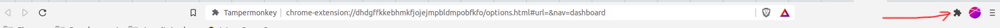
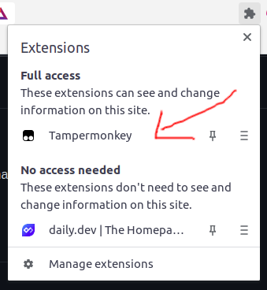
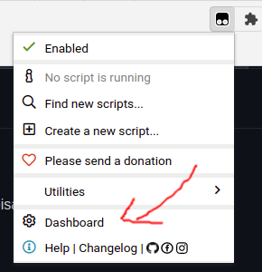
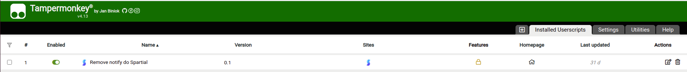
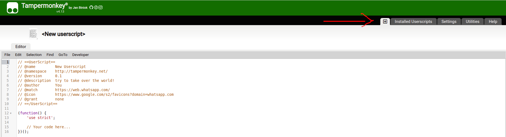

# tampermonkey
Snippets para facilitar algumas coisas

## Pré requisitos
Para utilizar os Snippets, precisa ter instalado em seu Browser, a extensão [TamperMonkey](https://chrome.google.com/webstore/detail/tampermonkey-beta/gcalenpjmijncebpfijmoaglllgpjagf)

## Após instalação
Agora precisa adicionar os Snippets, para isso:

> Acesse a página local da extensão, siga as imagens

1. 
1. 
1. 

> Neste momento, estamos localizados na lista de Snippets instalados.

1. 

> Agora vamos criar um novo Snippet, para isso, clique na aba [+]

1. 

> Agora, copie o conteúdo do Snippet desejado e cole ali no **Novo Snippet**

> Para salvar, basta dar um **CTRL+S**