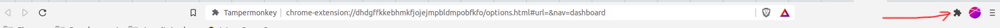

# tampermonkey
Snippets para facilitar algumas coisas

## Pré requisitos
Para utilizar os Snippets, precisa ter instalado em seu Browser, a extensão [TamperMonkey](https://chrome.google.com/webstore/detail/tampermonkey-beta/gcalenpjmijncebpfijmoaglllgpjagf)

## Após instalação
Agora precisa adicionar os Snippets, para isso:

> Acesse a página local da extensão
